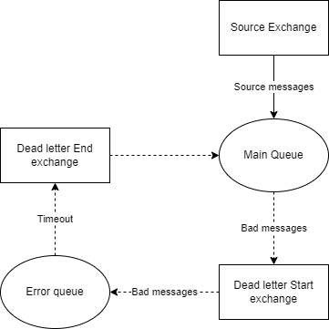

# Rabbiter
A convenient library for working with RabbitMQ for consuming and publishing messages via JSON.
Among the mechanisms:
- Automatic reconnection in case of server unavailability
- Ability to connect, publish and consume to multiple Rabbit MQ instances.
- Logging
- Convenient and configurable consumption of messages with automatic creation of the necessary objects.
- Management of parallel processing of messages.
- Dead Letter mechanism via RabbitMQ to reprocess unsuccessful messages.
- Dependency Injection
- Publication of messages through one interface with a pool of producers to reduce the load.

## Example

Let's create a message that we want to receive and process.
*It is important to mark the constructor with the [JsonConstructor] attribute, and all properties must have the init key property; or set; so that the deserializer can set the values.*
```
public class CreateCustomerRequestMessage : IEventBusMessage
{
    [JsonConstructor]
    public CreateCustomerRequestMessage(string fullName)
    {
        FullName = fullName;
    }

    [JsonPropertyName("fullName")]
    public string FullName { get; init; }
}
```
As a result of processing this message, we want to publish a new message that a new customer has been created:
```
public class CustomerCreatedMessage : IEventBusMessage
{
    public const string ExchangeName = "customer_created_exchange";

    [JsonConstructor]
    public CustomerCreatedMessage(int id, string fullName, DateTime createDate)
    {
        Id = id;
        FullName = fullName;
        CreateDate = createDate;
    }

    [JsonPropertyName("id")]
    public int Id { get; init; }

    [JsonPropertyName("fullName")]
    public string FullName { get; init; }

    [JsonPropertyName("updateDate")]
    public DateTime CreateDate { get; init; }
}
```

Add a CreateCustomerRequestMessage message handler:
```
public class CreateCustomerRequestHandler : IEventBusMessageHandler<CreateCustomerRequestMessage>
{
    private readonly IEventBusPublisher _publisher;
    private readonly Random _random;

    public CreateCustomerRequestHandler(IEventBusPublisher publisher)
    {
        _publisher = publisher;
        _random = new Random();
    }

    public Task HandleAsync(CreateCustomerRequestMessage message, CancellationToken cancellationToken)
    {
        // some kind of logic for adding a customer to the database.
        var response = new CustomerCreatedMessage(_random.Next(1, 1000), message.FullName, DateTime.Now);

        // publish a new message to the default instance with exchange name customer_created_exchange.
        _publisher.PublishToExchangeAsync(CustomerCreatedMessage.ExchangeName, response);

        // for example, you can publish a message to another connection instance, and also specify a routing key so that the receiving party can filter messages.
        //_publisher.PublishToExchangeAsync("OtherInstance", CustomerCreatedMessage.ExchangeName, response, "routingKey");

        return Task.CompletedTask;
    }
}
```

Now let's register the Rabbiter in the DI container as follows by executing the configuration:
```
builder.Services.AddRabbiter(rabbiter =>
{
    // add a new instance.
    // this way you can support consuming/publishing from different rabbit mq server.
    // also in this method you can specify the name of the instance to distinguish between them when logging and sending messages,
    // if not specified, the default name "Default" will be used.
    rabbiter.AddInstance(
        connectionConfig => builder.Configuration.GetSection("RabbitMQ:Connection").Bind(connectionConfig),
        instance =>
        {
            // specify that from this instance we will consume messages
            instance.SetupConsumer(
                consumerConfig => builder.Configuration.GetSection("RabbitMQ:Consumer").Bind(consumerConfig),
                consumer =>
                {
                    // specify the name of the exchange, the type of message, the type of handler, and also configure if necessary
                    // the library itself will create the specified exchange, as well as the associated queue for consuming.
                    consumer.SubscribeExchange<CreateCustomerRequestMessage, CreateCustomerRequestHandler>("create_customer_request_exchange", exchange =>
                    {
                        exchange.SetMaxDegreeOfParallelism(2);
                        exchange.UseDeadLetter(deadLetter =>
                        {
                            deadLetter.SetDelay(TimeSpan.FromHours(1));
                            deadLetter.SetMaxRetryCount(3);
                        });
                    });
                });

            // indicate that we will also publish to this instance.
            instance.SetupProducer(producerConfig => builder.Configuration.GetSection("RabbitMQ:Producer").Bind(producerConfig));

            // if you need to create queues, exchanges, perform a binding, do it here.
            instance.SetupInitOperations(init =>
            {
                // when publishing messages, the exchange or queue is not created by itself, as this would be costly per publish call.
                // therefore, if we publish something, we need to make sure that the exchange is created.
                // you can do this manually on the Rabbit MQ server or here at the initialization stage.

                // create an exchange where we will publish a message when customer created.
                init.DeclareExchange(o => o.SetName(CustomerCreatedMessage.ExchangeName));
            });
        });

    // rabbiter.AddInstance("OtherInstance", ...)
});
```


Add the following lines to the application configuration file:
```
"RabbitMQ": {
    "Connection": {
      "HostName": "localhost",
      "Port": 5672,
      "UserName": "guest",
      "Password": "guest",
      "RetryTimeout": "00:00:05",
      "MaxReconnectCount": "10"
    },
    "Consumer": {
      "ConsumerGroup": "serviceName",
      "MaxDegreeOfParallelism": 8
    },
    "Producer": {
      "MaxPoolLength": 20
    }
  }
```

Now, if we publish a message in the create_customer_request_exchange - our application will process it and publish a new message that the customer has been created.

## Consuming
Consuming configuration:
- **ConsumerGroup**: The name of the consumer group where the messages will be consumed. If multiple services consume from the same exchange within the same consumer group, messages will be distributed among them. In addition, each consumer group will receive its own copy of the message within the same exchange. Thus, for each microservice, you set your own unique group name so that multiple instances of this microservice distribute the processing load by Round-Robin.
 - **MaxDegreeOfParallelism**: The maximum number of threads that can be allocated to process messages within a single instance. Note that concurrency can be configured separately for each subscription.

To consume, you must create a message that implements the *IEventBusMessage* interface.
As well as a handler that implements *IEventBusMessageHandler\<TMessage\>* - where TMessage is the type of this message. The handler is registered as a **Scoped service**, so you can resolve any type you need from the constructor.

There are two methods available for subscribing to consumption:
### **SubscribeExchange** - for consumption from exchange
When consumed from an exchange, the exchange itself (durable) with the specified name and type *fanout* is automatically created (you can override this by calling *ConfigureExchange*), as well as a queue with the automatic name *{exchangeName}_{consumerGroup}_main_queue*. You can override the name of the queue by calling the ConfigureQueue method. It is also possible to configure the binding using the *ConfigureBinding* method.
#### Dead letter
Call the *UseDeadLetter* method to configure the mechanism.
The mechanism works as follows:

If an unhandled error occurs in the message handler, the message will go to the Dead Letter Start Exchange and its associated queue. Then, after the specified timeout, RabbitMQ will place this message on the End Exchange, which will be associated with the main queue. Thus, the message will be processed again. You can specify the maximum number of attempts, after which the message will stop going through this cycle.

 ### **SubscribeQueue** - to consume from the queue directly.
The Dead letter mechanism is not yet supported.

## Producing
Producer configuration:
- MaxPoolLength - the maximum number of producers that can publish in parallel. To do this, a pool of channels will be created through which the publication will take place.

Use IEventBusPublisher to publish. Publishing is supported both in a queue and in an exchange with the necessary parameters.
